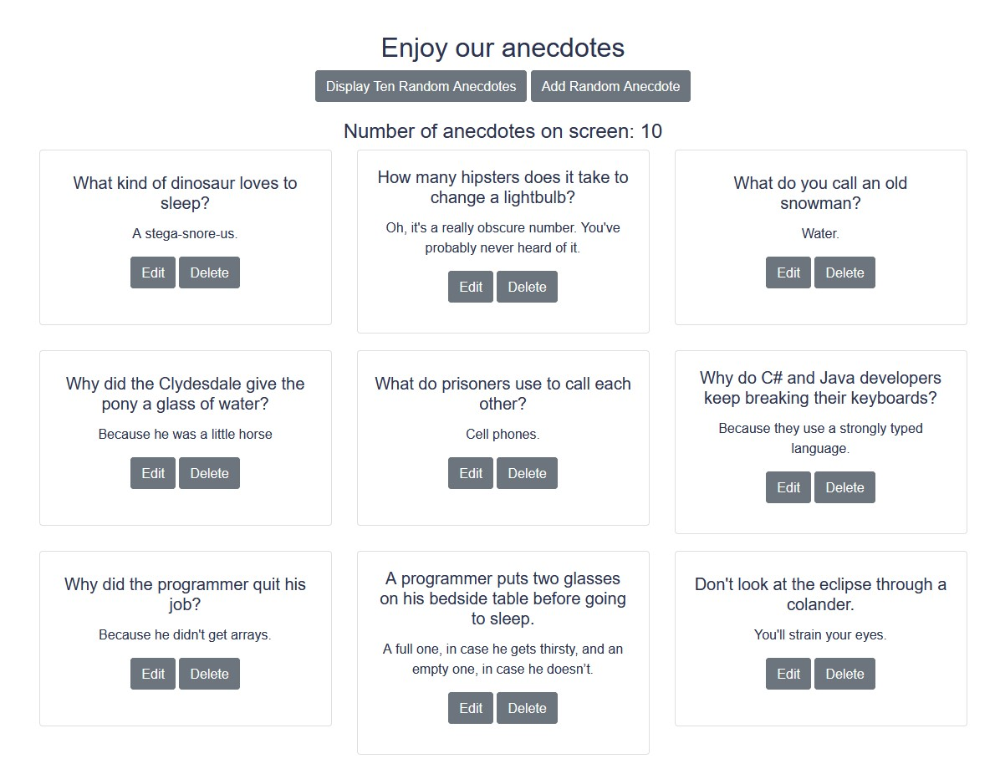

# Anecdotes

> An app for anecdotes

I created this apps for jokes, mainly to refresh and practice my Vuex and Vue Router knowledge/skills. The app allows you to display random jokes from a [jokes API](https://github.com/15Dkatz/official_joke_api), delete and edit existing jokes.

